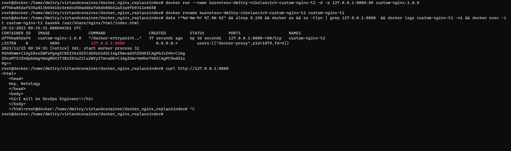
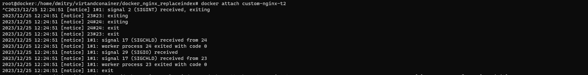
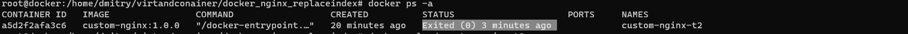
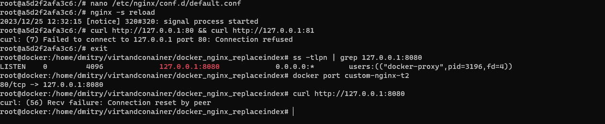
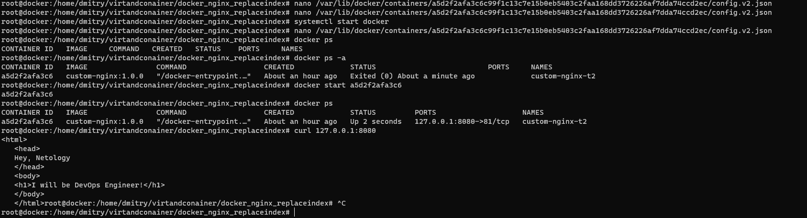
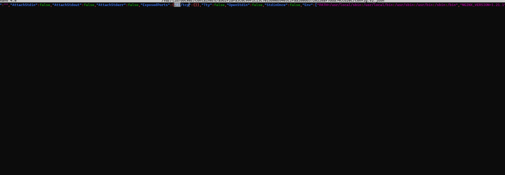
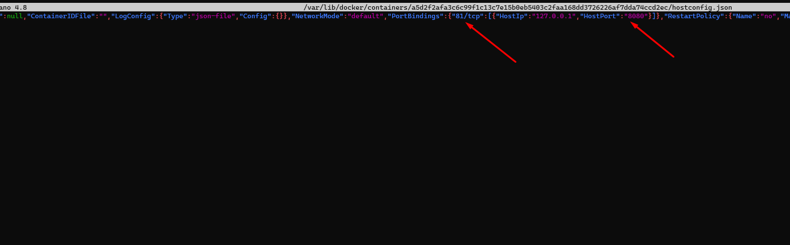
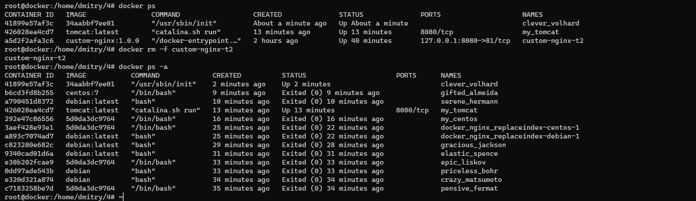

Задание 1

image url: https://hub.docker.com/repository/docker/morgotq/custom-nginx/general

Задание 2

Задание 3

1-3)docker attach 

docker attach custom-nginx-t2 - команда подключает нас к процессу с PID(1) внутри контейнера (это init). CTRL-C отправляет сигнал на прерывание этому процессу (SIGINT). После обработки сигнала контейнер останавливается, так как без init контейнер не может работать.

4-10)

Мы сменили прослушиваюющий порт nginx в конфиге. После этого перезапустили его, в это время nginx перечитал конфиг.
Внутри контейнера curl http://127.0.0.1:80 ничего не показывает, потому что нет ничего, что слушает на этом порту в контейнере.

На хостовой части curl http://127.0.0.1:8080
curl: (56) Recv failure: Connection reset by peer
Соединение сбрасывается из-за того, что у нас :8080 порт привязан к порту контейнера :80, на котором в контейнере ничего не засетано.

11.)

Остановил daemon докер, изменил в конфиге контейнера порты, запустил daemon и контейнер - все ок.

12.)

docker rm -f 'id/name'

Задание 4.

