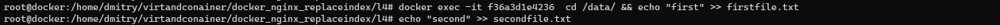
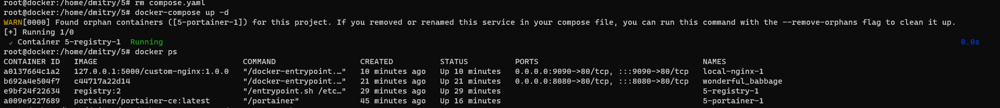
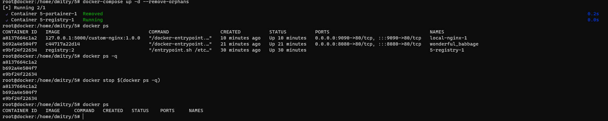

Задание 1

image url: https://hub.docker.com/repository/docker/morgotq/custom-nginx/general

Задание 2

Задание 3

1-3)docker attach 

docker attach custom-nginx-t2 - команда подключает нас к процессу с nginx внутри контейнера. CTRL-C отправляет сигнал на прерывание этому процессу (SIGINT). После обработки сигнала контейнер останавливается.

4-10)

Мы сменили прослушиваюющий порт nginx в конфиге. После этого перезапустили его, в это время nginx перечитал конфиг.
Внутри контейнера curl http://127.0.0.1:80 ничего не показывает, потому что нет ничего, что слушает на этом порту в контейнере.

На хостовой части curl http://127.0.0.1:8080
curl: (56) Recv failure: Connection reset by peer
Соединение сбрасывается из-за того, что у нас :8080 порт привязан к порту контейнера :80, на котором в контейнере ничего не засетано.

11.)

Остановил daemon докер, изменил в конфиге контейнера порты, запустил daemon и контейнер - все ок.

12.)

docker rm -f 'id/name'

Задание 4.

Ранаю два контейнера и пробрасываю volume с директории хостовой системы до директорий контейнеров.

Создаю два файла: один в первом контейнере, второй - на хостовой части

Проверка файлов и содержимое

Задание 5.

Каноническое имя для docker-compose файла - compose.yaml/yml.
Также поддерживается docker-compose.yaml/yml
Если в каталоге два таких файла, будет выбрат compose.yaml.yml по-умолчанию.

Добавил директиву include в compose.yaml, чтобы запустилось два компоуз файла.

Выполнил docker-compose up -d - два файла конфигурации успешно исполнились и запущено два контейнера.

push в локальный registry 

inspect local-nginx container

Удалил compose.yaml. Появилось предупреждение о сиротских контейнерах, которые раньше были использованы в компоуз файле.
Рекомендовано использовать docker-compose up -d --remove-orphans для remove сиротских контейнеров.

Исполнил docker-compose up -d --remove-orphans, сиротский контейнер потух, остался один, который прописан в манифесте.
Потушил остальные контейнеры.